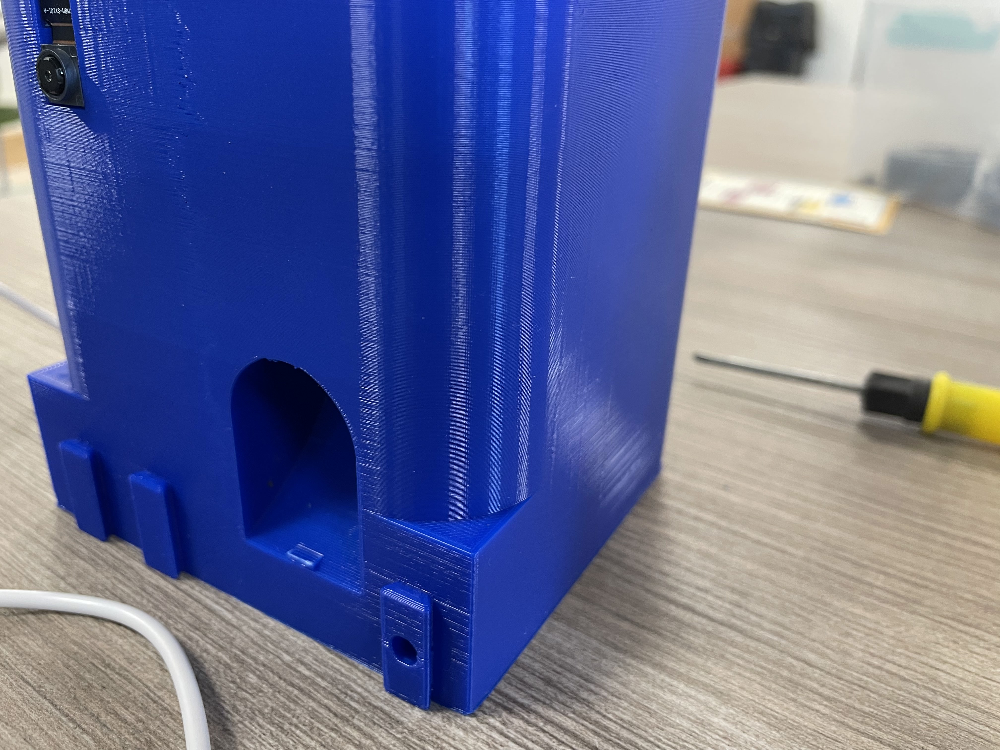
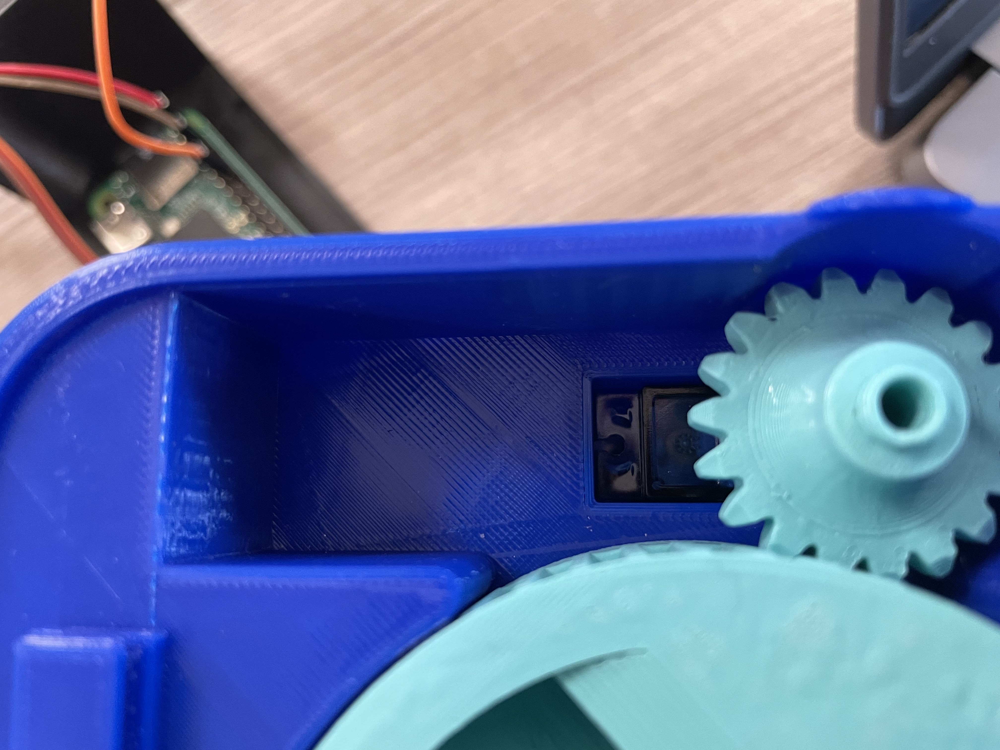
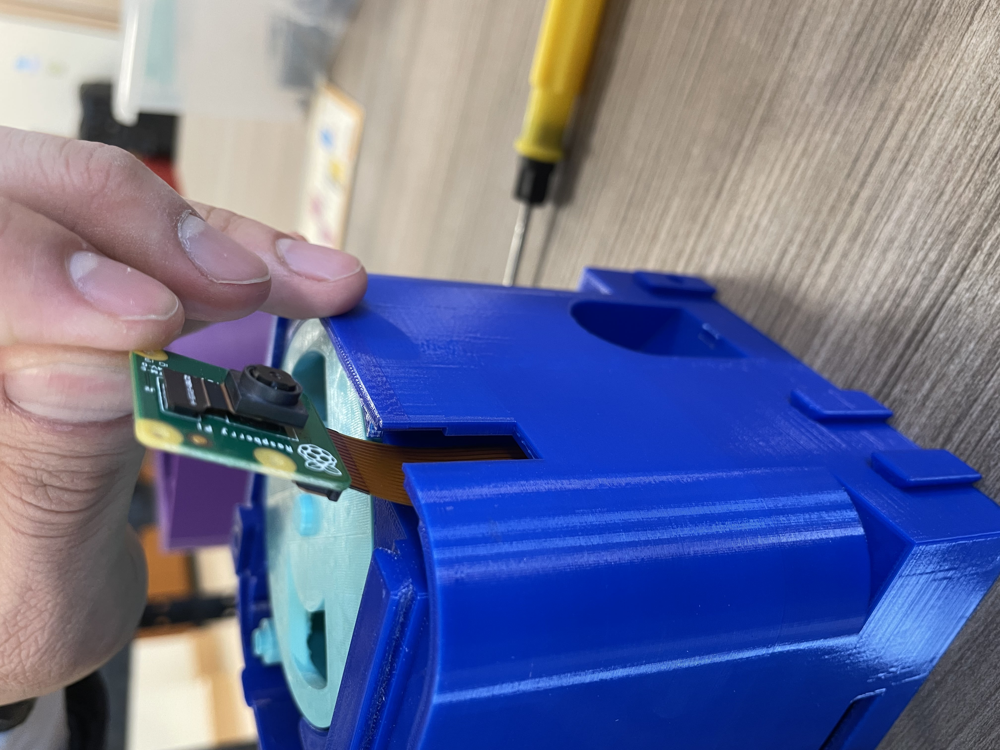

# Catfeeder
This is a tutorial to build your own automatic catfeeder using raspberry pi, some 3D printing, a camera, and a continuous servo motor!

# Materials
- Raspberry Pi
- Raspberry Pi Camera
- 6 Wires
- A Continuous 360 Degress Servo Motor
- A Computer
- A 3D Printer
- 3D Printing Filament, 400 Metric Grams
- 3 Pen Springs

# Guide
1. Download all the files in the Github Repo to your computer
2. Save all the .STL files in a separate folder.
3. Save motiondetect-2.py somewhere you can access it.
## Part 1 - Program
4. Open motiondetect-2.py using an IDE of your choice, or simply with notepad.
5. Take out your Raspberry Pi, motor, and camera, and connect them like so:

If in doubt, check the card that comes with your Raspberry Pi. The motor should be connected to PIN 18.
5. Use the white wire to connect the Pi to your computer.
6. Open windows powershell and connect the Pi using SSH. The command should be ssh pi@yourpiname.local, the default password is raspberry.
7. Open a new document called catfeeder by typing sudo nano catfeeder.py
8. Copy the code from motiondetect-2.py, then go back to windows powershell and press right click. This should paste the code into the powershell.
9. Press ctrl + x to leave the file. Press enter, then y, then enter again.
10. Install the dependencies necessary by typing:
  - sudo apt-get install libgtkmm-3.0-1
  - sudo apt-get install libnotify4
  - sudo apt-get update
  - sudo apt-get install python3-pip
  - sudo pip3 install imutils
  - sudo pip3 install opencv-python
12. Ensure that the camera is facing a still background.
13. Test run the program by typing python3 catfeeder.py
14. After the terminal prints "Meow", try to make the camera observe a moving object. When it does, the motor should turn 520 degrees.
15. Congrats, you've finished the programming part of this project.
## Part 2 - 3D Printing
16. Access the 3D printer using a USB or cable.
17. Open one of the STL files that is saved in a separate folder using Cura or another application of your choice.
18. Adjust the settings to appropriate sizes, and nausil to 0.2 mm or smaller.
19. Slice the product and save the file into the USB.
20. Plug the USB into the printer and start printing.
21. Wait until the print finishes. Repeat steps 17 to 20 for every other STL component.
22. Congrats, you've finished the 3D printing part of this project.
## Part 3 - Assembly
23. Clean out all the support from the base body and assembly the cylinders onto the flat washer for the bearing as in the photo below.

24. Assembly the servo motor then the spinner/gearing parts as in the photo below.

25. Check out if the camera wire hole was clear. Place the camera into the camera hole, the camera wire should be attached and go all the way in. As the photo below.

26. Place the hexagon structure holder on top of the base, it should connect and hold the two gearing parts together.
27. Assembly the door switch as photos below. (optional)

28. Slide the Raspberry Pi into the Pi holder and connect all the wires in the same manner as the program part.
29. There are three connection systems in the base in order the connect and stable the other parts the feeder(front), the upper body (top right) and the pi holder(bottom). place the springs then the cylinder with a round head into the hole push it in a little in order to slide the parts in, a tool might be needed for the pi holder connector.
30. Plugin the USB connector from the side to connect it to the computer.
31. Congrats, you now have a completed automatic catfeeder.
